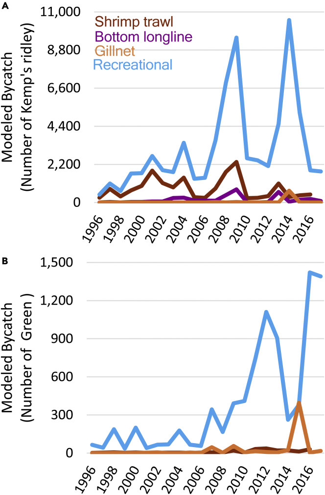

```{r setup, include=FALSE}
# Set options, housekeeping
knitr::opts_chunk$set(
	echo = TRUE,
	include = TRUE,
	message = FALSE,
	warning = FALSE)
```

# Workshop 3: Advanced data wrangling: Extracting ecological signals from noisy systems

## Exercise 1: Plot Deconstruction

### Selected Original Figure
#### Original Figure from Putman et al. (2023), showing annual modelled bycatch of Kemp's ridley and green turtles across fishery and gear types.
```{r}
#| echo: false
#| out-width: "40%"


```
### The Message

#### The figure shows how modeled juvenile sea turtle bycatch varied among fishery types and through time from 1996–2017 for Kemp’s ridley turtles (Panel A) and green turtles (Panel B). Presenting the two species together allows the reader to compare fishery-specific patterns in modeled bycatch between species. Recreational fisheries generally produced the highest modeled bycatch for both species, although the magnitude and temporal patterns differed between species and among fisheries.

### The Flaws
#### 1. The colour scheme is not very accessible and makes some fisheries difficult to distinguish. The figure relies almost entirely on colour to distinguish the four fisheries, with no differences in line type or point shape to provide an additional visual cue. This creates an accessibility issue because readers with some forms of colour-vision deficiency may have difficulty distinguishing between the lines. The fisheries would also be difficult to distinguish if the figure were printed or viewed in greyscale. Using both an accessible colour palette and different line types would make the figure easier to interpret for a wider range of readers.
#### 2. Large differences in modeled bycatch magnitude obscure patterns in the smaller fisheries. There are substantial differences in the magnitude of modeled bycatch among fisheries. In Panel A, recreational bycatch reaches approximately 10,000 turtles, while bottom longline and gillnet estimates remain comparatively small. Because all fisheries within the panel share the same y-axis, these lower values are compressed towards the bottom of the plot, making their temporal variation difficult to distinguish. A similar issue occurs in Panel B, where recreational modelled bycatch reaches approximately 1,400 turtles while several other fishery estimates remain close to zero. Although the data are technically displayed, patterns within lower-bycatch fisheries are difficult to interpret. This is important because smaller levels of bycatch may still be ecologically and conservation relevant. Although alternative approaches, such as transforming the y-axis or separating fisheries into additional panels, could make variation in the lower-bycatch fisheries more visible, I chose to retain the shared y-axis within each species panel. This preserves the substantial differences in the magnitude of modelled bycatch among fisheries, which are themselves an important feature of the data.
#### 3. The fishery labels are inconsistent between panels and reduce readability. Rather than using a conventional legend, the fishery names are displayed within the plotting area of Panel A. Panel B contains no corresponding labels, requiring the reader to refer back to Panel A and remember which colour represents each fishery. The labels also occupy a relatively large part of the plot area and are not positioned directly beside their corresponding lines, meaning they do not provide the usual advantage of direct labelling. It also makes the figure appear unnecessarily cluttered.
#### 4. The figure has limitations associated with its spreadsheet-style presentation.The figure has several characteristics typical of plots produced using spreadsheet software such as Excel. While Excel can produce valid scientific figures, R provides greater control over figure aesthetics, accessibility and reproducibility. Reconstructing the figure in R allows the complete workflow from data manipulation to the final visualisation to be documented in code and reproduced consistently.

### Part 1: Data Wrangling

```{r}
# Load packages
library(tidyverse)
library(readxl)
library(here)
library(lubridate)

# List the sheets in the dataset
excel_sheets(
  here::here("data", "workshop3", "Remake-figure-dataset.xlsx"))

# Import the shrimp trawl modelled risk data
shrimp_risk <- read_excel(
  here::here("data", "workshop3", "Remake-figure-dataset.xlsx"),
  sheet = "Table S2 - Shrimp_Risk")
glimpse(shrimp_risk) # shows that r is reading the first row of the spreadsheet as column names but is actually a descriptive heading and creating names for the blank ones

shrimp_risk |>
  print(n = 49) # look at the rows, shows the sheet contains two separate tables stacked vertically

# Reimport eacg table separately, skipping the descriptive heading and blank rows
shrimp_kemps <- read_excel(
  here::here("data", "workshop3", "Remake-figure-dataset.xlsx"),
  sheet = "Table S2 - Shrimp_Risk",
  skip = 1, # ignore first row and use next as column headings
  n_max = 22) # after finding those headings, import only the following 22 years
glimpse(shrimp_kemps)

# Convert risk columns to numeric
shrimp_kemps <- shrimp_kemps |>
  mutate(
    across( # apply numeric to every column but year
      -Year,
      as.numeric))

# Reshape from wide to long
shrimp_kemps_long <- shrimp_kemps |>
  pivot_longer(
    cols = -Year, # reshape every column except year
    names_to = "region",
    values_to = "risk")
# Before cntinuing to clean and wrangle I then looked at how the authors created the figure I am recreating

# Sum Kemp's ridley shrimp-risk indices across regions for each year
shrimp_kemps_annual <- shrimp_kemps_long |>
  group_by(Year) |>
  summarise(
    total_risk = if_else(
      all(is.na(risk)),
      NA_real_,
      sum(risk, na.rm = TRUE)),
    .groups = "drop")

shrimp_kemps_annual

# Calculate annual modelled Kemp's ridley bycatch from shrimp trawls
shrimp_kemps_annual <- shrimp_kemps_annual |>
  mutate(
    modelled_bycatch = total_risk * 6e-10)

shrimp_kemps_annual

# Import the green turtle shrimp-risk table
shrimp_green <- read_excel(
  here::here("data", "workshop3", "Remake-figure-dataset.xlsx"),
  sheet = "Table S2 - Shrimp_Risk",
  skip = 27,
  n_max = 22)

# Convert green turtle shrimp-risk values to numeric
shrimp_green <- shrimp_green |>
  mutate(
    across(
      -Year,
      as.numeric))

# Reshape green turtle shrimp-risk data from wide to long format
shrimp_green_long <- shrimp_green |>
  pivot_longer(
    cols = -Year,
    names_to = "region",
    values_to = "risk")

# Sum green turtle shrimp-risk indices across regions for each year
shrimp_green_annual <- shrimp_green_long |>
  group_by(Year) |>
  summarise(
    total_risk = if_else(
      all(is.na(risk)),
      NA_real_,
      sum(risk, na.rm = TRUE)),
    .groups = "drop")

shrimp_green_annual

# Calculate annual modelled green turtle bycatch from shrimp trawls
shrimp_green_annual <- shrimp_green_annual |>
  mutate(
    modelled_bycatch = total_risk * 5e-12)

shrimp_green_annual

# Inspect the recreational fishery risk data
rec_risk <- read_excel(
  here::here("data", "workshop3", "Remake-figure-dataset.xlsx"),
  sheet = "Table S3 - Rec_Risk")

print(rec_risk, n = Inf)

# Import the Kemp's ridley recreational-risk table
rec_kemps <- read_excel(
  here::here("data", "workshop3", "Remake-figure-dataset.xlsx"),
  sheet = "Table S3 - Rec_Risk",
  skip = 1,
  n_max = 22)

# Reshape Kemp's ridley recreational-risk data from wide to long format
rec_kemps_long <- rec_kemps |>
  pivot_longer(
    cols = -Year,
    names_to = "region",
    values_to = "risk")

# Sum Kemp's ridley recreational-risk indices across regions for each year
rec_kemps_annual <- rec_kemps_long |>
  group_by(Year) |>
  summarise(
    total_risk = if_else(
      all(is.na(risk)),
      NA_real_,
      sum(risk, na.rm = TRUE)),
    .groups = "drop")

rec_kemps_annual

# Calculate annual modelled Kemp's ridley bycatch from recreational fishing
rec_kemps_annual <- rec_kemps_annual |>
  mutate(
    modelled_bycatch = total_risk * 9e-10)

rec_kemps_annual

# Import the green turtle recreational-risk table
rec_green <- read_excel(
  here::here("data", "workshop3", "Remake-figure-dataset.xlsx"),
  sheet = "Table S3 - Rec_Risk",
  skip = 27,
  n_max = 22)

# Reshape green turtle recreational-risk data from wide to long format
rec_green_long <- rec_green |>
  pivot_longer(
    cols = -Year,
    names_to = "region",
    values_to = "risk")

# Sum green turtle recreational-risk indices across regions for each year
rec_green_annual <- rec_green_long |>
  group_by(Year) |>
  summarise(
    total_risk = if_else(
      all(is.na(risk)),
      NA_real_,
      sum(risk, na.rm = TRUE)),
    .groups = "drop")

rec_green_annual

# Calculate annual modelled green turtle bycatch from recreational fishing
rec_green_annual <- rec_green_annual |>
  mutate(
    modelled_bycatch = total_risk * 5e-12)

rec_green_annual


# Inspect the bottom longline risk data
bll_risk <- read_excel(
  here::here("data", "workshop3", "Remake-figure-dataset.xlsx"),
  sheet = "Table S4 - BLL_Risk")

print(bll_risk, n = Inf)

# Import the Kemp's ridley bottom-longline risk table
bll_kemps <- read_excel(
  here::here("data", "workshop3", "Remake-figure-dataset.xlsx"),
  sheet = "Table S4 - BLL_Risk",
  skip = 1,
  n_max = 22)

# Reshape Kemp's ridley bottom-longline risk data from wide to long format
bll_kemps_long <- bll_kemps |>
  pivot_longer(
    cols = -Year,
    names_to = "region",
    values_to = "risk")

# Sum Kemp's ridley bottom-longline risk indices across regions for each year
bll_kemps_annual <- bll_kemps_long |>
  group_by(Year) |>
  summarise(
    total_risk = if_else(
      all(is.na(risk)),
      NA_real_,
      sum(risk, na.rm = TRUE)),
    .groups = "drop")

bll_kemps_annual

# Calculate annual modelled Kemp's ridley bycatch from bottom longline
bll_kemps_annual <- bll_kemps_annual |>
  mutate(
    modelled_bycatch = total_risk * 5e-10)

bll_kemps_annual

# Inspect the gillnet risk data
gillnet_risk <- read_excel(
  here::here("data", "workshop3", "Remake-figure-dataset.xlsx"),
  sheet = "Table S5 - Gillnet_Risk")

print(gillnet_risk, n = Inf)

# Import the Kemp's ridley gillnet-risk table
gillnet_kemps <- read_excel(
  here::here("data", "workshop3", "Remake-figure-dataset.xlsx"),
  sheet = "Table S5 - Gillnet_Risk",
  skip = 1,
  n_max = 22)

glimpse(gillnet_kemps)

# Reshape Kemp's ridley gillnet-risk data from wide to long format
gillnet_kemps_long <- gillnet_kemps |>
  select(-sum, -where(~ all(is.na(.)))) |>
  pivot_longer(
    cols = -Year,
    names_to = "region",
    values_to = "risk")

# Sum Kemp's ridley gillnet-risk indices across regions for each year
gillnet_kemps_annual <- gillnet_kemps_long |>
  group_by(Year) |>
  summarise(
    total_risk = if_else(
      all(is.na(risk)),
      NA_real_,
      sum(risk, na.rm = TRUE)),
    .groups = "drop")

# Calculate annual modelled Kemp's ridley bycatch from gillnets
gillnet_kemps_annual <- gillnet_kemps_annual |>
  mutate(
    modelled_bycatch = total_risk * 4e-6)

gillnet_kemps_annual

# Import the green turtle gillnet-risk table
gillnet_green <- read_excel(
  here::here("data", "workshop3", "Remake-figure-dataset.xlsx"),
  sheet = "Table S5 - Gillnet_Risk",
  skip = 27,
  n_max = 22)

# Reshape green turtle gillnet-risk data from wide to long format
gillnet_green_long <- gillnet_green |>
  select(-sum, -where(~ all(is.na(.)))) |>
  pivot_longer(
    cols = -Year,
    names_to = "region",
    values_to = "risk")
# Sum green turtle gillnet-risk indices across regions for each year
gillnet_green_annual <- gillnet_green_long |>
  group_by(Year) |>
  summarise(
    total_risk = if_else(
      all(is.na(risk)),
      NA_real_,
      sum(risk, na.rm = TRUE)),
    .groups = "drop")

gillnet_green_annual

# Calculate annual modelled green turtle bycatch from gillnets
gillnet_green_annual <- gillnet_green_annual |>
  mutate(
    modelled_bycatch = total_risk * 5e-8)

gillnet_green_annual

# Combine Kemp's ridley modelled-bycatch data across fisheries
kemps_bycatch <- bind_rows(
  shrimp_kemps_annual |>
    mutate(fishery = "Shrimp trawl"),
  
  rec_kemps_annual |>
    mutate(fishery = "Recreational"),
  
  bll_kemps_annual |>
    mutate(fishery = "Bottom longline"),
  
  gillnet_kemps_annual |>
    mutate(fishery = "Gillnet")
) |>
  mutate(species = "Kemp's ridley") |>
  select(Year, species, fishery, modelled_bycatch)

# Combine green turtle modelled-bycatch data across fisheries
green_bycatch <- bind_rows(
  shrimp_green_annual |>
    mutate(fishery = "Shrimp trawl"),
  
  rec_green_annual |>
    mutate(fishery = "Recreational"),
  
  gillnet_green_annual |>
    mutate(fishery = "Gillnet")
) |>
  mutate(species = "Green turtle") |>
  select(Year, species, fishery, modelled_bycatch)

# Combine both species into one modelled-bycatch dataset
figure3_data <- bind_rows(
  kemps_bycatch,
  green_bycatch)

glimpse(figure3_data)

# Check the number of observations for each species and fishery
figure3_data |>
  count(species, fishery)
```

### Part 2: Plotting

```{r}
# Plot annual modelled bycatch by species and fishery draft
ggplot(
  figure3_data,
  aes(
    x = Year,
    y = modelled_bycatch,
    colour = fishery,
    group = fishery)
) +
  geom_line() +
  facet_wrap(
    ~ species,
    scales = "free_y",
    ncol = 1)

# Set species order to match the original figure
figure3_data <- figure3_data |>
  mutate(
    species = factor(
      species,
      levels = c("Kemp's ridley", "Green turtle")))

# Change axis titles, line colours and types
# Final plot code
remake_figure_turt_bycatch <- ggplot(
  figure3_data,
  aes(
    x = Year,
  y = modelled_bycatch,
  colour = fishery,
  linetype = fishery,
  group = fishery
  )
) +
  geom_line(linewidth = 0.7) +
  facet_wrap(
    ~ species,
    scales = "free_y",
    ncol = 1
  ) +
  scale_colour_manual(
    name = "Fishery",
    values = c(
     "Shrimp trawl" = "darkblue",
      "Bottom longline" = "#D55E00",
      "Gillnet" = "#009E73",
      "Recreational" = "#CC79A7")
  ) +
  scale_linetype_manual(
  name = "Fishery",
  values = c(
    "Shrimp trawl" = "dotdash",
    "Bottom longline" = "solid",
    "Gillnet" = "longdash",
    "Recreational" = "dashed"
  )
) +
  scale_x_continuous(
  breaks = seq(1996, 2017, by = 3),
  limits = c(1996, 2017)
) +
  labs(
    x = "Year",
    y = "Modeled bycatch"
  ) + 
  theme_minimal(base_size = 14) +
theme(
  axis.title = element_text(
    size = 15,
  ),
  axis.text = element_text(
    size = 12
  ),
  strip.text = element_text(
    size = 14,
  ),
  legend.title = element_text(
    size = 14,
  ),
  legend.text = element_text(
    size = 12
  )
)
```

Figure 1. Annual modelled bycatch of juvenile Kemp's ridley and green turtles across commercial and recreational fisheries in the southeastern United States from 1996 to 2017. Lines represent modelled bycatch associated with shrimp trawl, bottom longline, gillnet and recreational fisheries, calculated from the spatial overlap between predicted turtle abundance and fishing effort combined with fishery-specific bycatch rates. Bottom longline modelled bycatch is shown only for Kemp's ridley turtles because a corresponding bycatch rate was not available for green turtles. Note that y-axis scales differ between species to accommodate differences in the magnitude of modelled bycatch. Colours and line types distinguish fisheries to improve accessibility and interpretation.

## Exercise 2: Queensland fisheries data discovery challenge

### Part 1: Sourcing data
#### I have chosen Shark Control Program non-target species statistics in a 10 year period from the year 2008-2017. 

#### Management Question: Which non-target species were most frequently caught in the Queensland Shark Control Program, where were catches highest and how did these patterns change from 2008 to 2017? Catch abundance is compared among species, management areas and years to identify spatial and temporal patterns in non-target catch that may be relevant to fisheries managers and community stakeholders.

### Part 2: Independent Wrangling and Communication

#### Data loading and wrangling
```{r}
# Identify Shark Control Program data files
shark_files <- list.files(
  here::here("data", "workshop3"),
  pattern = "SharkControl.*\\.csv$",
  full.names = TRUE)

shark_files

# Inspect column names across annual datasets
shark_columns <- shark_files |>
  set_names() |>
  map(read_csv, show_col_types = FALSE) |> # imports each of the 10 CSV files
  map(names) # extracts only the column names from each dataset

shark_columns

# Import and combine annual Shark Control Program datasets
shark_data <- shark_files |>
  set_names() |>
  map_dfr(
    ~ read_csv(
      .x,
      col_types = cols(Date = col_character()),
      show_col_types = FALSE
    ) |>
      select(
        `Species Name`,
        Date,
        Area,
        Location,
        `Number Caught`
      ),
    .id = "source_file")

# Extract year from source filename
shark_data <- shark_data |>
  mutate(
    year = basename(source_file) |>
      str_extract("20\\d{2}") |>
      as.integer()) # converts it from text to a numeric year

count(shark_data, year) # lets us check that all 10 years are present

# Inspect species recorded in the dataset
shark_data |>
  count(`Species Name`, sort = TRUE)

# Inspect rows with missing species names
shark_data |>
  filter(is.na(`Species Name`)) |>
  summarise(
    missing_date = sum(is.na(Date)),
    missing_area = sum(is.na(Area)),
    missing_location = sum(is.na(Location)),
    missing_number_caught = sum(is.na(`Number Caught`)),
    total_rows = n())

# Remove completely empty catch records
shark_data <- shark_data |>
  filter(!is.na(`Species Name`))

nrow(shark_data)

# Inspect unique species names
shark_data |>
  distinct(`Species Name`) |>
  arrange(`Species Name`) |>
  print(n = Inf)

# Check inconsistent species labels by year
shark_data |>
  filter(str_detect(`Species Name`, "\\*|GIANT SHOVELNOSED R|GROPER")) |>
  count(year, `Species Name`) |>
  arrange(`Species Name`, year)

# Standardise obvious inconsistencies in species names 
shark_data <- shark_data |>
  mutate(
    `Species Name` = str_remove(`Species Name`, "\\s*\\*$"),
    `Species Name` = case_when(
      `Species Name` == "GROPER , QLD" ~ "GROPER, QLD",
      `Species Name` == "GIANT SHOVELNOSED R" ~ "GIANT SHOVELNOSED RAY",
      TRUE ~ `Species Name`))
```

#### Ecological Aggregation
```{r}
# Calculate total catch abundance by species
species_catch <- shark_data |>
  group_by(`Species Name`) |>
  summarise(
    total_caught = sum(`Number Caught`, na.rm = TRUE),
    .groups = "drop"
  ) |>
  arrange(desc(total_caught))

species_catch

# Calculate total non-target catch by management area
area_catch <- shark_data |>
  group_by(Area) |>
  summarise(
    total_caught = sum(`Number Caught`, na.rm = TRUE),
    .groups = "drop"
  ) |>
  arrange(desc(total_caught))

area_catch

# Identify the five most frequently caught species
top_species <- species_catch |>
  slice_max(total_caught, n = 5) |>
  pull(`Species Name`)

top_species

# Calculate annual catch for the five most frequently caught species
annual_species_catch <- shark_data |>
  filter(`Species Name` %in% top_species) |>
  group_by(year, `Species Name`) |>
  summarise(
    total_caught = sum(`Number Caught`, na.rm = TRUE),
    .groups = "drop")

annual_species_catch

# Add zero catches for missing species-year combinations
annual_species_catch <- annual_species_catch |>
  complete(
    year = 2008:2017,
    `Species Name` = top_species,
    fill = list(total_caught = 0))

annual_species_catch

# Calculate annual catch of top species by management area
species_area_year <- shark_data |>
  filter(`Species Name` %in% top_species) |>
  group_by(year, Area, `Species Name`) |>
  summarise(
    total_caught = sum(`Number Caught`, na.rm = TRUE),
    .groups = "drop")

species_area_year

# Summarise catch of top species by management area
species_area_catch <- shark_data |>
  filter(`Species Name` %in% top_species) |>
  group_by(`Species Name`, Area) |>
  summarise(
    total_caught = sum(`Number Caught`, na.rm = TRUE),
    .groups = "drop"
  ) |>
  arrange(`Species Name`, desc(total_caught))

species_area_catch
```

#### Visual Layout
```{r}
# Explore catch trends by species and management area
ggplot(
  species_area_year,
  aes(
    x = year,
    y = total_caught,
    colour = Area,
    group = Area
  )
) +
  geom_line(linewidth = 0.8) +
  geom_point(size = 1.8) +
  facet_wrap(
    ~ `Species Name`,
    scales = "free_y"
  ) +
  scale_x_continuous(
    breaks = seq(2008, 2017, by = 2)
  ) +
  labs(
    x = "Year",
    y = "Number of individuals caught",
    colour = "Management area"
  ) +
  theme_minimal(base_size = 13) +
  theme(
    panel.grid.minor = element_blank(),
    strip.text = element_text(size = 12),
    legend.position = "right"
  )

# Calculate percentage of each species' catch by management area to simplify in figure
species_area_percent <- species_area_catch |>
  group_by(`Species Name`) |>
  mutate(
    species_total = sum(total_caught),
    percent_catch = (total_caught / species_total) * 100
  ) |>
  arrange(`Species Name`, desc(percent_catch)) |>
  ungroup()

species_area_percent

# Identify management areas contributing at least 10% of each species' catch
major_areas <- species_area_percent |>
  filter(percent_catch >= 10) |>
  select(`Species Name`, Area) |>
  mutate(major_area = TRUE)

major_areas

# Group lower-contributing management areas as "Other areas"
species_area_year_simple <- species_area_year |>
  left_join(
    major_areas,
    by = c("Species Name", "Area")
  ) |>
  mutate(
    area_display = if_else(
      is.na(major_area),
      "Other areas",
      Area
    )
  ) |>
  group_by(year, `Species Name`, area_display) |>
  summarise(
    total_caught = sum(total_caught),
    .groups = "drop"
  )

species_area_year_simple

# Explore simplified spatial and temporal catch patterns
ggplot(
  species_area_year_simple,
  aes(
    x = year,
    y = total_caught,
    colour = area_display,
    group = area_display
  )
) +
  geom_line(linewidth = 0.8) +
  geom_point(size = 1.8) +
  facet_wrap(
    ~ `Species Name`,
    scales = "free_y"
  ) +
  scale_x_continuous(
    breaks = seq(2008, 2017, by = 2)
  ) +
  labs(
    x = "Year",
    y = "Number of individuals caught",
    colour = "Management area"
  ) +
  theme_minimal(base_size = 13) +
  theme(
    panel.grid.minor = element_blank(),
    strip.text = element_text(size = 12),
    legend.position = "right"
  )

# Create publication-friendly species names
species_area_year_simple <- species_area_year_simple |>
  mutate(
    species_display = str_to_sentence(`Species Name`))

# Final plot code
ggplot(
  species_area_year_simple,
  aes(
    x = year,
    y = total_caught,
    colour = area_display,
    group = area_display
  )
) +
  geom_line(linewidth = 0.8) +
  geom_point(size = 1.8) +
  facet_wrap(
    ~ species_display,
  scales = "free_y"
  ) +
  scale_x_continuous(
    breaks = seq(2008, 2017, by = 2)
  ) +
  labs(
    x = "Year",
    y = "Number of individuals caught",
    colour = "Management area"
  ) +
  theme_minimal(base_size = 13) +
  theme(
    panel.grid.minor = element_blank(),
    strip.text = element_text(size = 12),
    legend.position = "right"
  )


catch_area_plot <- ggplot(
  species_area_year_simple,
  aes(
    x = year,
    y = total_caught,
    colour = area_display,
    group = area_display
  )
) +
  geom_line(linewidth = 0.8) +
  geom_point(size = 2) +

  facet_wrap(
    ~ species_display,
    scales = "free_y",
    ncol = 3,
    axes = "all_x"
  ) +

  scale_x_continuous(
    breaks = seq(2008, 2017, by = 2),
    limits = c(2008, 2017)
  ) +

  labs(
    x = "Year",
    y = "Number of individuals caught",
    colour = "Management area"
  ) +

  theme_classic(base_size = 14) +

  theme(
    axis.title = element_text(size = 14),
    axis.text = element_text(size = 11),
    strip.text = element_text(size = 13),
    legend.title = element_text(size = 13),
    legend.text = element_text(size = 11),
    legend.position = "right",
    panel.spacing.y = unit(1, "lines"),
    panel.spacing.x = unit(1, "lines")
  )

catch_area_plot
```
Figure 2. Annual catch of the five most frequently caught species recorded in the Queensland Shark Control Program dataset between 2008 and 2017, separated by management area. Points represent the total number of individuals caught within each area and year, with lines showing temporal patterns in catch. For each species, management areas contributing at least 10% of the species' total catch across the study period are displayed separately, while areas contributing less than 10% are combined as “Other areas”. Note that y-axis scales differ among species to accommodate substantial differences in catch magnitude. Cownose rays had the highest overall catch and were predominantly caught on the Gold Coast, whereas catches of other species showed different spatial and temporal patterns.

### Part 3: Report Writing

#### Management Interpretation and Recommendation
The analysis indicates that non-target catch in the Queensland Shark Control Program was unevenly distributed among species, management areas and years between 2008 and 2017. Cownose rays had the highest total catch among the five most frequently caught non-target species, with catches strongly concentrated on the Gold Coast and a pronounced peak in 2009. Other species showed different spatial patterns, including catfish catches concentrated in Townsville and loggerhead turtle catches distributed across several management areas. These patterns demonstrate that non-target capture is not consistent across the Queensland coast and that particular species–area combinations may contribute disproportionately to overall bycatch.

Monitoring and bycatch mitigation efforts should prioritise species and management areas with consistently high or periodically elevated non-target catches, rather than applying a uniform approach across all Shark Control Program locations. In particular, the concentration of cownose ray catches on the Gold Coast and catfish catches in Townsville suggests that area-specific patterns warrant further investigation. For conservation sensitive species such as marine turtles and dolphins, continued monitoring of spatial and temporal catch patterns could help identify locations or periods where targeted mitigation measures may be most effective. These catch data should be interpreted alongside information on fishing effort, gear deployment and species abundance before concluding that differences in catch represent differences in population-level risk.
